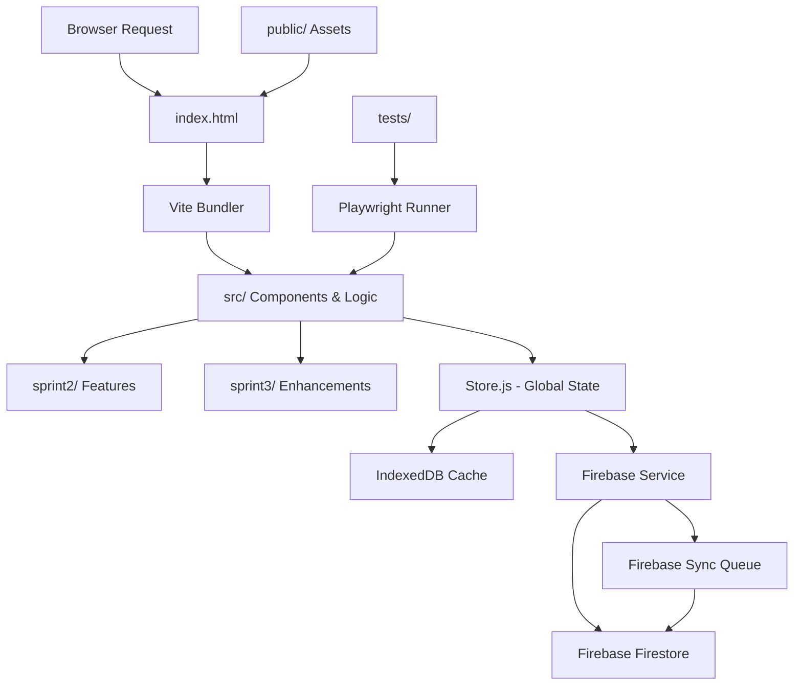

```markdown
<!-- agent-update:start:architecture-notes -->
# Architecture Notes

The system is a frontend web application developed iteratively across sprints, utilizing Vite as the build tool for a modern JavaScript/TypeScript stack. The design emphasizes modular development in `src/`, with separate sprint directories (`sprint2/`, `sprint3/`) for feature isolation during agile cycles. This structure supports rapid prototyping and testing with Playwright, while maintaining a lightweight deployment suitable for static hosting.

## System Architecture Overview
The application follows a monolithic frontend architecture, structured as a single-page application (SPA) bundled by Vite. Requests are handled client-side: the `index.html` entry point loads assets from `public/`, initializes the app from `src/`, and renders dynamically via JavaScript modules. Control flows from the entry point through imported components and utilities in `src/`, with no server-side rendering in the current setup. Deployment is static-file based, deployable to CDNs or simple web servers, with sprints representing phased enhancements (e.g., `sprint2/` for initial features, `sprint3/` for refinements).

## Core System Components
- `Doc/` — Documentation files (approximately 5 files), including guides and notes.
- `SAVES/` — Backup or saved artifacts (approximately 2 files).
- `public/` — Static assets like images and favicons (approximately 2 files).
- `sprint2/` — Feature implementations from sprint 2 (approximately 6 files), focusing on core UI and logic.
- `sprint3/` — Feature implementations from sprint 3 (approximately 6 files), including enhancements and integrations.
- `src/` — Main application source code, including components, utilities, and app entry (approximately 52 files).
  - `src/config/firebase.js` — Firebase configuration and initialization
  - `src/services/firebase-service.js` — Firestore CRUD operations and real-time listeners
  - `src/services/firebase-sync.js` — Offline queue and synchronization management
  - `src/services/firebase-cache.js` — IndexedDB cache for local persistence
  - `src/services/firebase-sync-notifications.js` — Toast notifications for sync status
  - `src/store.js` — Global state management with Firebase integration
- `tests/` — Test suites, likely using Playwright or similar (approximately 8 files).

Configuration and tooling:
- `package.json` and `package-lock.json` — NPM dependencies and scripts.
- `vite.config.js` — Vite build configuration for development and production.
- `playwright.config.js` — End-to-end testing setup.
- `index.html` — Application entry point.
- `README.md` — Project root documentation.

## Internal System Boundaries
The system is primarily frontend-focused, with bounded contexts in `src/` divided by sprints (e.g., `sprint2/` owns initial data handling, `sprint3/` extends with UI interactions). Data persistence is managed through a hybrid approach:

- **Local Storage (Primary)**: IndexedDB via `firebase-cache.js` for offline-first operation
- **Remote Sync (Optional)**: Firebase Firestore for multi-device synchronization when configured
- **State Management**: Global store (`store.js`) with Observer pattern for reactive updates

The system implements an **offline-first architecture** where all operations work locally, with optional Firebase synchronization when credentials are configured. Sprint folders enforce feature isolation to prevent cross-contamination during development. Shared contracts are minimal, relying on ES modules for imports.

## System Integration Points
Inbound interfaces are limited to browser events and URL routing handled by the Vite dev server or router in `src/`. Outbound, the app likely orchestrates API calls from `src/` modules (e.g., fetch to external endpoints for data like `dados.json` references). No explicit event buses or webhooks; coordination with other services would occur via HTTP requests triggered from components in sprint directories.

## External Service Dependencies
- **Firebase Firestore** (Optional): Cloud database for multi-device synchronization
  - Configuration via environment variables (`VITE_FIREBASE_*`)
  - Graceful degradation: System works fully offline if Firebase is not configured
  - Real-time synchronization with conflict resolution (last-write-wins)
  - Offline queue: Operations are queued when offline and synced when online
  - See [Firebase Architecture](./firebase-architecture.md) for detailed documentation
- **NPM ecosystem**: Vite, Firebase SDK, and other build-time dependencies
- **Browser APIs**: DOM, Fetch, IndexedDB, Service Workers for PWA functionality

Failure handling: 
- Firebase operations: Retry logic with 3 attempts, offline queue persistence
- Client-side error boundaries in `src/` catch fetch failures
- Graceful degradation ensures system works without Firebase

## Key Decisions & Trade-offs
- **Vite over Webpack**: Chosen for faster HMR and simpler config, reducing build times in iterative sprints (trade-off: less mature plugin ecosystem but sufficient for this scale).
- **Sprint-based Folder Structure**: Enables parallel development and easy rollback (e.g., `sprint2/` as baseline), but introduces temporary duplication; planned consolidation post-sprint3.
- **Playwright for Testing**: Selected for cross-browser E2E tests over Jest for UI fidelity (trade-off: heavier setup but better for SPA validation).
- **Firebase Firestore for Sync**: Chosen for real-time synchronization and offline support (trade-off: requires configuration but provides multi-device sync; system works without it).
- **Offline-First Architecture**: All operations work locally with IndexedDB; Firebase sync is optional enhancement (trade-off: requires more complex state management but ensures reliability).
- **Last-Write-Wins Conflict Resolution**: Simple strategy for MVP (trade-off: may lose some concurrent edits but acceptable for single-user scenarios).

Supporting docs: See sprint folders for commit histories; Firebase architecture documented in [firebase-architecture.md](./firebase-architecture.md).

## Diagrams


This diagram illustrates the high-level flow from entry to rendering, with testing oversight and data persistence layers (local IndexedDB and optional Firebase sync).

## Risks & Constraints
- **Performance**: Large `src/` (52 files) may impact bundle size; monitor with Vite analytics. Constraint: Client-side only, so offline support limited without service workers.
- **Scaling**: Suitable for low-traffic SPAs; high concurrency requires CDN optimization. Assumption: No real-time features, but sprint3 may introduce async ops.
- **Technical Debt**: Sprint folders risk fragmentation; plan migration to unified `src/` post-sprint3. Active risks: Undocumented external API dependencies could introduce breakage.
- **Testing Coverage**: 8 test files suggest focus on E2E; unit tests may be sparse.

## Top Directories Snapshot
- `Doc/` — approximately 5 files (documentation).
- `SAVES/` — approximately 2 files (backups).
- `public/` — approximately 2 files (static assets).
- `sprint2/` — approximately 6 files (sprint 2 features).
- `sprint3/` — approximately 6 files (sprint 3 features).
- `src/` — approximately 52 files (core source).
- `tests/` — approximately 8 files (test suites).

<!-- agent-readonly:guidance -->
## AI Update Checklist
1. Review ADRs, design docs, or major PRs for architectural changes.
2. Verify that each documented decision still holds; mark superseded choices clearly.
3. Capture upstream/downstream impacts (APIs, events, data flows).
4. Update Risks & Constraints with active incident learnings or TODO debt.
5. Link any new diagrams or dashboards referenced in recent work.

<!-- agent-readonly:sources -->
## Acceptable Sources
- ADR folders, `/docs/architecture` notes, or RFC threads.
- Dependency visualisations from build tooling or scripts.
- Issue tracker discussions vetted by maintainers.

## Related Resources
- [Project Overview](./project-overview.md)
- Update [agents/README.md](../agents/README.md) when architecture changes.

<!-- agent-update:end -->
```
