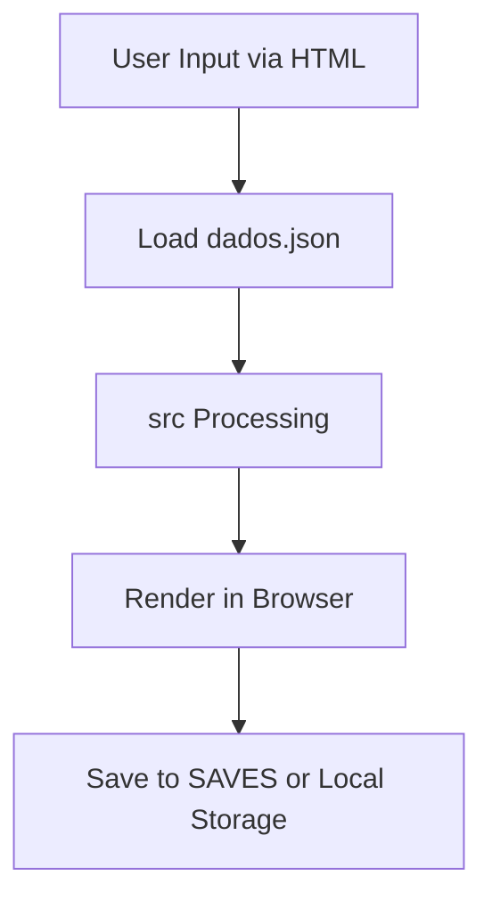

<!-- agent-update:start:data-flow -->
# Data Flow & Integrations

Explain how data enters, moves through, and exits the system, including interactions with external services.

## High-level Flow
The application is a static web app built with Vite, serving content through `index.html` and `estudos.html`. Data entry begins with user interactions on the frontend (e.g., form inputs or selections in `estudos.html`), loading static data from `dados.json` in the root or `public` directory. Processing occurs in `src` modules (e.g., JavaScript components for data manipulation and rendering). Output is rendered dynamically in the browser, with potential saves to local storage or the `SAVES` directory for user-generated files. No server-side processing is involved; the flow is client-side only. For visualization, refer to the architecture overview in [docs/architecture.md](architecture.md) (if available) or the Mermaid diagram in `README.md`:

## Internal Movement
Data moves through the application via client-side JavaScript in `src`, which handles DOM updates, event listeners, and data transformations. Key collaborations include:
- `public` directory serves static assets (e.g., CSS, images) loaded by `index.html` and `estudos.html`.
- `dados.json` provides initial dataset, parsed and manipulated in `src` scripts (e.g., filtering or aggregating data for display in `estudos.html`).
- User actions trigger events in `src` (e.g., button clicks saving outputs to `SAVES` folder via File API or downloads).
- Testing in `tests` uses Playwright (`playwright.config.js`) to simulate flows, ensuring data integrity across sprints (`sprint2`, `sprint3` folders contain iterative implementations).
- Build process via `vite.config.js` and `package.json` bundles `src` into optimized assets for deployment. No queues, events, or shared databases are used; movement is synchronous via function calls and browser APIs.

Dependencies from `package-lock.json` ensure consistent module resolution during development.

## External Integrations
Currently, the application has no active external integrations, as it operates as a fully client-side web app without API calls to third-party services. Data remains local to the browser or filesystem (e.g., `SAVES` exports). 

Future integrations planned (based on sprint roadmaps in `sprint3`):
- **Local File System API** — Purpose: Enable direct read/write for `dados.json` and saves without downloads. Authentication: None (browser permission-based). Payload shapes: JSON objects for data import/export. Retry strategy: None needed; falls back to manual file handling on denial.
- **Potential API Integration (e.g., External Data Source)** — Purpose: Fetch dynamic datasets to supplement `dados.json` (e.g., via a REST API for real-time studies). Authentication: API key in headers. Payload shapes: GET requests return JSON arrays; POST for updates. Retry strategy: Exponential backoff with 3 attempts, using browser fetch API.

Refer to [docs/integrations.md](integrations.md) for expansion details once implemented.

## Observability & Failure Modes
- **Metrics and Logs**: Client-side console logging via `console.log/error` in `src` for debugging. Playwright tests (`playwright.config.js`) generate reports in `tests` for E2E flow validation. No server metrics; browser dev tools track performance (e.g., Network tab for asset loads).
- **Traces**: Manual via browser console or integrated with Vite's dev server logs. Future: Consider Sentry or similar for error tracking.
- **Failure Modes**: 
  - Data load failures (e.g., corrupted `dados.json`): Graceful degradation with fallback empty state in UI.
  - Browser compatibility: Tests cover modern browsers; polyfills in `package.json` for older ones.
  - Save failures (e.g., `SAVES` write denied): User notification and download prompt as compensating action. No dead-letter queues; errors logged to console.
  - Sprint-specific: `sprint2` and `sprint3` changes introduce versioned flows; rollbacks via git.

For triage, use Playwright traces or `README.md` runbooks.

<!-- agent-readonly:guidance -->
## AI Update Checklist
1. Validate flows against the latest integration contracts or diagrams.
2. Update authentication, scopes, or rate limits when they change.
3. Capture recent incidents or lessons learned that influenced reliability.
4. Link to runbooks or dashboards used during triage.

<!-- agent-readonly:sources -->
## Acceptable Sources
- Architecture diagrams, ADRs, integration playbooks.
- API specs, queue/topic definitions, infrastructure code.
- Postmortems or incident reviews impacting data movement.

<!-- agent-update:end -->
