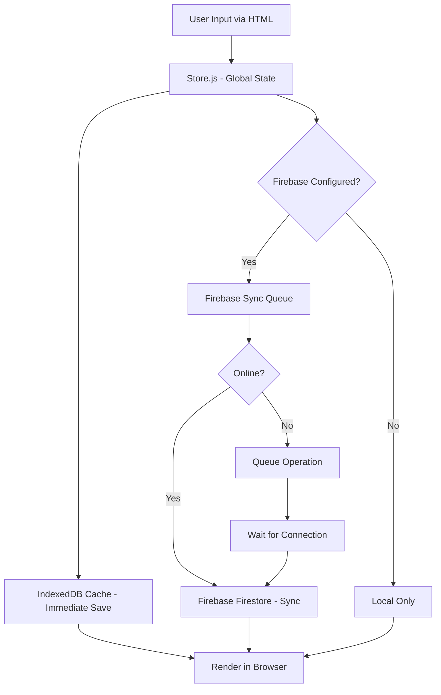

<!-- agent-update:start:data-flow -->
# Data Flow & Integrations

Explain how data enters, moves through, and exits the system, including interactions with external services.

## High-level Flow
The application is a static web app built with Vite, serving content through `index.html` and `estudos.html`. Data entry begins with user interactions on the frontend (e.g., form inputs or selections in `estudos.html`), loading static data from `dados.json` in the root or `public` directory. Processing occurs in `src` modules (e.g., JavaScript components for data manipulation and rendering). Output is rendered dynamically in the browser, with data persistence through a hybrid offline-first approach:

1. **Local Storage (Primary)**: All operations save immediately to IndexedDB via `firebase-cache.js`
2. **Remote Sync (Optional)**: When Firebase is configured, data synchronizes with Firestore for multi-device access
3. **Offline Queue**: Operations performed offline are queued and synced when connection is restored

For visualization, refer to the architecture overview in [docs/architecture.md](architecture.md) or the Mermaid diagram below:

## Internal Movement
Data moves through the application via client-side JavaScript in `src`, which handles DOM updates, event listeners, and data transformations. Key collaborations include:

- **State Management**: `store.js` manages global state with Observer pattern, notifying subscribers of changes
- **Local Persistence**: `firebase-cache.js` provides IndexedDB wrapper for immediate local saves
- **Remote Synchronization**: `firebase-service.js` handles Firestore CRUD operations; `firebase-sync.js` manages offline queue
- **Real-time Updates**: Firebase listeners (`subscribeToCollection`, `subscribeToDocument`) update local state when remote changes occur
- **Static Assets**: `public` directory serves static assets (e.g., CSS, images) loaded by `index.html` and `estudos.html`
- **Initial Data**: `dados.json` provides initial dataset, parsed and manipulated in `src` scripts
- **User Actions**: Trigger events in `src` that update store → IndexedDB → (optionally) Firebase queue
- **Testing**: `tests` uses Playwright (`playwright.config.js`) to simulate flows, ensuring data integrity
- **Build Process**: `vite.config.js` and `package.json` bundle `src` into optimized assets for deployment

**Synchronization Flow:**
1. User action → Store update → IndexedDB save (immediate)
2. If Firebase configured → Add to sync queue
3. If online → Sync immediately to Firestore
4. If offline → Queue persists in IndexedDB, syncs when connection restored
5. Remote changes → Firebase listeners → Store update → IndexedDB save → UI refresh

Dependencies from `package-lock.json` ensure consistent module resolution during development.

## External Integrations

### Firebase Firestore (Implemented)
- **Purpose**: Multi-device synchronization and cloud backup
- **Authentication**: Configuration via environment variables (`VITE_FIREBASE_*`)
- **Payload Shapes**: 
  - Collections: `/users/{userId}/{collectionName}/{docId}`
  - Documents: JSON objects with metadata (`_lastModified`, `_userId`)
- **Operations**: 
  - CRUD: `getDocument`, `setDocument`, `updateDocument`, `deleteDocument`
  - Batch: `batchWrite` (up to 500 operations)
  - Real-time: `subscribeToDocument`, `subscribeToCollection`
- **Retry Strategy**: 3 attempts with exponential backoff, offline queue persistence
- **Conflict Resolution**: Last-write-wins based on `_lastModified` timestamp
- **Graceful Degradation**: System works fully offline if Firebase is not configured
- **Documentation**: See [Firebase Architecture](./firebase-architecture.md) and [Firebase Setup](./firebase-setup.md)

### Local File System API (Future)
- **Purpose**: Enable direct read/write for `dados.json` and saves without downloads
- **Authentication**: None (browser permission-based)
- **Payload Shapes**: JSON objects for data import/export
- **Retry Strategy**: None needed; falls back to manual file handling on denial

Refer to [Firebase Quick Start](./firebase-quick-start.md) for getting started with Firebase integration.

## Observability & Failure Modes
- **Metrics and Logs**: 
  - Client-side console logging via `console.log/error` in `src` for debugging
  - Firebase operations logged with emoji prefixes (✅ success, ⚠️ warning, ❌ error)
  - Playwright tests (`playwright.config.js`) generate reports in `tests` for E2E flow validation
  - Browser dev tools track performance (Network tab for asset loads and Firebase requests)
  - Firebase Console provides server-side metrics and logs
- **Traces**: Manual via browser console or integrated with Vite's dev server logs. Firebase Console provides server-side traces. Future: Consider Sentry or similar for error tracking.
- **Failure Modes**: 
  - **Data load failures** (e.g., corrupted `dados.json`): Graceful degradation with fallback empty state in UI
  - **Firebase connection failures**: Operations queued locally, automatic retry when online
  - **Firebase sync failures**: Retry logic (3 attempts), failed operations logged; user notified via Toast
  - **IndexedDB failures**: Fallback to in-memory state; user warned about data loss risk
  - **Browser compatibility**: Tests cover modern browsers; polyfills in `package.json` for older ones
  - **Save failures** (e.g., `SAVES` write denied): User notification and download prompt as compensating action
  - **Sprint-specific**: `sprint2` and `sprint3` changes introduce versioned flows; rollbacks via git
- **Offline Queue**: Operations persist in IndexedDB, automatically sync when connection restored
- **Conflict Resolution**: Last-write-wins strategy; conflicts logged but not surfaced to user (acceptable for single-user MVP)

For triage, use Playwright traces, Firebase Console, or `README.md` runbooks. See [Firebase Troubleshooting](./firebase-setup.md#troubleshooting) for common issues.

<!-- agent-readonly:guidance -->
## AI Update Checklist
1. Validate flows against the latest integration contracts or diagrams.
2. Update authentication, scopes, or rate limits when they change.
3. Capture recent incidents or lessons learned that influenced reliability.
4. Link to runbooks or dashboards used during triage.

<!-- agent-readonly:sources -->
## Acceptable Sources
- Architecture diagrams, ADRs, integration playbooks.
- API specs, queue/topic definitions, infrastructure code.
- Postmortems or incident reviews impacting data movement.

<!-- agent-update:end -->
